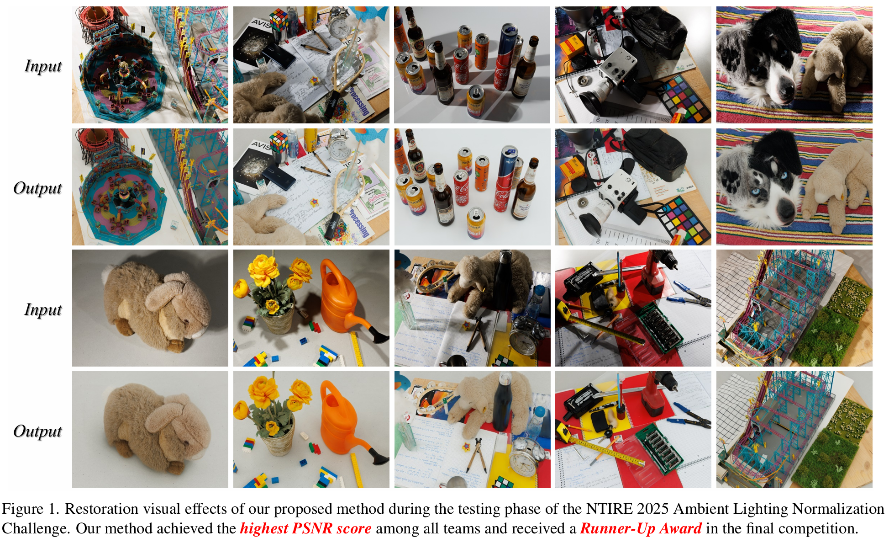

# AALN: Advancing Ambient Lighting Normalization via Diffusion Shadow Generation

<a href='https://openaccess.thecvf.com/content/CVPR2025W/NTIRE/papers/Lu_Advancing_Ambient_Lighting_Normalization_via_Diffusion_Shadow_Generation_CVPRW_2025_paper.pdf'></a> &nbsp;&nbsp;

## :trophy: Runner-Up of the CVPR 2025 Ambient Lighting Normalization Challenge

Our team **LightWorker** achieved the **Runner-Up Award** in the [CVPR 2025 Ambient Lighting Normalization Challenge](https://cvlai.net/ntire/2025/), with **26.50 dB PSNR** and **0.874 SSIM** on the final test set.

This is the official PyTorch implementation of the paper:

>**Advancing Ambient Lighting Normalization via Diffusion Shadow Generation**<br>
>Xin Lu, Jiarong Yang, Yuanfei Bao, Zihao Fan, Anya Hu, Kunyu Wang, Jie Xiao, Xi Wang, Hongjian Liu, Xueyang Fu<sup>&dagger;</sup>, Zheng-Jun Zha<br>
>University of Science and Technology of China (USTC)<br>
>CVPR Workshop 2025




## :wrench: Dependencies and Installation

```bash
git clone https://github.com/xin1u/AALN.git
cd AALN
pip install -r requirements.txt
```

**Main dependencies:** PyTorch >= 1.10, torchvision, numpy, Pillow, timm, tensorboard, lpips


## :file_folder: Project Structure

```
AALN/
    ├── ckpt/                         # Pre-trained checkpoints
    │   ├── best_model.pth            # Shadow removal model weights
    │   └── diffusion_shadow.pth      # Diffusion shadow generator weights
    ├── datasets/                     # Dataset loading
    │   └── datasets_pairs.py
    ├── loss/                         # Loss functions
    │   └── losses.py                 # Charbonnier, FFT, SSIM, LPIPS losses
    ├── networks/                     # Model architectures
    │   ├── aaln_arch.py              # Mask-free Shadow Removal U-Net (no global residual)
    │   ├── diffusion_shadow.py       # VP-SDE score network (NAFNet + AdaLN)
    │   ├── image_utils.py            # Image splitting & merging
    │   └── local_arch.py             # Local inference wrapper
    ├── utils/
    │   └── UTILS.py                  # Metrics & utilities
    ├── TEST.py                       # Inference script
    ├── train_aaln.py                 # Training script with diffusion shadow generation
    └── train_diffusion.py            # Train the VP-SDE shadow mask generator
```


## :surfer: Quick Start

**Step 1: Download Checkpoints**

Download the pre-trained checkpoint and place it in the `ckpt/` directory:
- `best_model.pth` — Shadow removal model

**Step 2: Run Testing**

```bash
python TEST.py \
    --eval_in_path ./test_images/ \
    --result_path ./results/
```

The restored results will be saved in `./results/`. A log file at `./results/log_file/test.txt` records per-image PSNR/SSIM metrics.

**Note:** Ensure both paths end with `/`.


## :muscle: Train

**Step 1: Prepare Data**

Prepare training pairs (degraded / ground-truth images). We use the CVPR 2025 Ambient Lighting Normalization dataset.

**Step 2: Train Diffusion Shadow Generator (Optional)**

Pre-train the VP-SDE shadow mask generator from paired shadow/clean images:

```bash
python train_diffusion.py \
    --shadow_dir ./data/train_shadow/ \
    --clean_dir ./data/train_clean/ \
    --save_path ./ckpt/ \
    --epochs 500 \
    --batch_size 16 \
    --lr 0.0002 \
    --crop_size 256
```

Or from pre-computed single-channel mask images:

```bash
python train_diffusion.py \
    --mask_dir ./data/shadow_masks/ \
    --save_path ./ckpt/ \
    --epochs 500
```

The trained model is saved as `ckpt/diffusion_shadow.pth`.

**Step 3: Three-stage Shadow Removal Training**

1. **Stage 1** — Train with Charbonnier + FFT loss (Adam, lr=4e-4, batch=12, patch=512, 1000 epochs):
```bash
python train_aaln.py \
    --experiment_name stage1 \
    --unified_path ./experiments/ \
    --training_path_txt data/train_list.txt \
    --eval_in_path /PATH/val_input/ \
    --eval_gt_path /PATH/val_gt/ \
    --BATCH_SIZE 12 \
    --Crop_patches 512 \
    --learning_rate 0.0004 \
    --EPOCH 1000 \
    --base_loss char \
    --addition_loss fft \
    --addition_loss_coff 0.02 \
    --use_shadow_gen True
```

2. **Stage 2** — Fine-tune with Charbonnier + SSIM loss (Adam, lr=4e-5, batch=2, patch=768, 300 epochs):
```bash
python train_aaln.py \
    --experiment_name stage2 \
    --unified_path ./experiments/ \
    --load_pre_model True \
    --pre_model ./experiments/stage1/best_model.pth \
    --BATCH_SIZE 2 \
    --Crop_patches 768 \
    --learning_rate 0.00004 \
    --EPOCH 300 \
    --base_loss char \
    --addition_loss ssim \
    --addition_loss_coff 0.2 \
    --grad_accum_steps 6 \
    --use_shadow_gen True
```

3. **Stage 3** — Fine-tune with Charbonnier + LPIPS loss (SGD, lr=1e-5, batch=6, patch=1024):
```bash
python train_aaln.py \
    --experiment_name stage3 \
    --unified_path ./experiments/ \
    --load_pre_model True \
    --pre_model ./experiments/stage2/best_model.pth \
    --BATCH_SIZE 6 \
    --Crop_patches 1024 \
    --learning_rate 0.00001 \
    --base_loss char \
    --addition_loss lpips \
    --addition_loss_coff 0.6 \
    --optim sgd \
    --grad_accum_steps 2 \
    --use_shadow_gen True
```


## :book: Citation

If you find our repo useful for your research, please consider citing our paper:

```bibtex
@InProceedings{Lu_2025_CVPR,
    author    = {Lu, Xin and Yang, Jiarong and Bao, Yuanfei and Fan, Zihao and Hu, Anya and Wang, Kunyu and Xiao, Jie and Wang, Xi and Liu, Hongjian and Fu, Xueyang and Zha, Zheng-Jun},
    title     = {Advancing Ambient Lighting Normalization via Diffusion Shadow Generation},
    booktitle = {Proceedings of the IEEE/CVF Conference on Computer Vision and Pattern Recognition (CVPR) Workshops},
    month     = {June},
    year      = {2025}
}
```


## :postbox: Contact

Please feel free to contact us if there is any question (luxion@mail.ustc.edu.cn).
